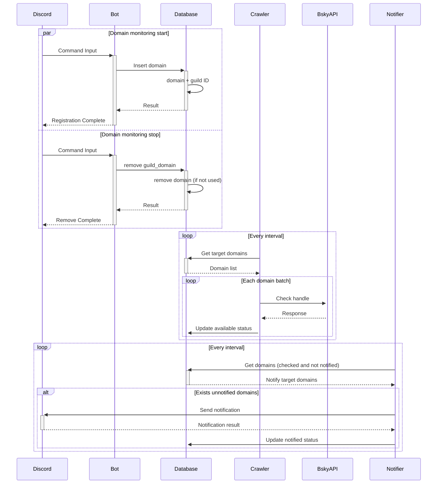

# Sequence

```mermaid
sequenceDiagram
    participant Discord
    participant Bot
    participant DB as Database
    participant Crawler
    participant BskyAPI
    participant Notifier

    par Domain monitoring start
        %% Domain Monitoring Start Flow
        Discord->>+Bot: Command Input
        Bot->>+DB: Insert domain
        DB->>DB: domain + guild ID
        DB-->>-Bot: Result
        Bot-->>-Discord: Registration Complete
    and Domain monitoring stop
        %% Domain Monitoring Stop Flow
        Discord->>+Bot: Command Input
        Bot->>+DB: remove guild_domain
        DB->>DB: remove domain (if not used)
        DB-->>-Bot: Result
        Bot-->>-Discord: Remove Complete
    end

    %% Crawler Flow
    loop Every interval
        Crawler->>+DB: Get target domains
        DB-->>-Crawler: Domain list
        loop Each domain batch
            Crawler->>+BskyAPI: Check handle
            BskyAPI-->>+Crawler: Response
            Crawler->>+DB: Update available status
        end
    end

    %% Notification Flow
    loop Every interval
        Notifier->>+DB: Get domains (checked and not notified)
        DB-->>-Notifier: Notify target domains
        
        alt Exists unnotified domains 
            Notifier->>+Discord: Send notification
            Discord-->>-Notifier: Notification result
            Notifier->>+DB: Update notified status
        end
    end
```
